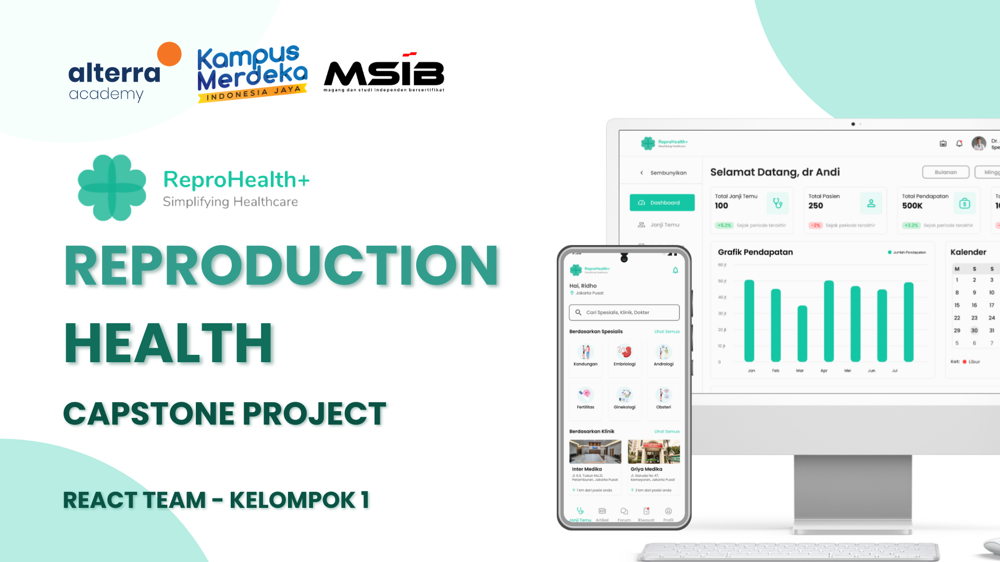

<!-- TITLE -->

<div id="readme-top" align="center" >
   <h1>
    ReproHealth+ Capstone Project
    </h1>
    <a  href="https://github.com/othneildrew/Best-README-Template">
        
    </a>
    <br />
</div>
<p align="center">
    <b>ReproHealth+</b> An application for reproductive health education and consultation.
    <br />
    <a href="https://reprohealth.netlify.app/"><strong>View Demo »</strong></a>
    <br />
    <br />
    <a href="https://github.com/team-capstone-1/fe-repro-health/issues">Report Bug</a>
    ·
    <a href="https://github.com/team-capstone-1/fe-repro-health/issues">Request Feature</a>
</p>

<!-- TABLE OF CONTENTS -->
<details>
  <summary>Table of Contents</summary>
  <ul>
    <li>
      <a href="#about-the-project">About The Project</a>
    </li>
    <li><a href="#getting-started">Getting Started</a></li>
    <li><a href="#project-management">Project Management</a></li>
    <li><a href="#build-with">Build With</a></li>
    <li><a href="#folder-structure">Folder Structure</a></li>
  </ul>
</details>

---

## About The Project



<b>ReproHealth+</b> merupakan aplikasi kesehatan reproduksi yang bertujuan untuk meningkatkan edukasi lebih lanjut kepada masyarakat terkait cara menjaga dan menanggulangi masalah kesehatan reproduksi. Aplikasi ini menyediakan fitur yang dapat dimanfaatkan oleh masyarakat luas dan dokter yang terdaftar.

Fitur Kami:

- Landing Page
- Dashboard
- Janji Temu
- Jadwal Saya
- Artikel
- Forum
- Chatbot
- Profile
- Notifications

<p align="right"><a href="#readme-top"> Back to top  &#187;</a></p>
<br/>

---

## Getting Started

> Follow these instructions to setting up your project and running it locally:

### Prerequisites

Make sure you have installed this on your computer, or run this syntax on your terminal.

- npm

  ```sh
  npm install npm@latest -g
  ```

### Installation

1. Clone the repo

   ```sh
   git clone https://github.com/team-capstone-1/fe-repro-health.git
   ```

2. Open the Folder

   ```sh
   cd fe-repro-health
   ```

3. Install NPM packages

   ```sh
   npm install
   ```

4. Running the App

   ```sh
   npm run dev
   ```

<p align="right"><a href="#readme-top"> Back to top  &#187;</a></p>
<br/>

---

## Project Management

- Tools Management by [Trello](https://trello.com/b/p98N36ej/react-section "Trello")

- Tools Management by [Google Sheet](https://docs.google.com/spreadsheets/d/19hWmioxQcot7XRc-tBKNSKc15jsOboLjY8s74rWJsrs/edit?usp=sharing "Google Sheet")

<p align="right"><a href="#readme-top"> Back to top  &#187;</a></p>
<br/>

---

## Build With

The framework and libraries we used to bootstrap our project:

-  

- 

- 

- 

- 

- 

<p align="right"><a href="#readme-top"> Back to top  &#187;</a></p>
<br/>

---

## Folder Structure

```
├── public
├── src
│   ├── apis
│   ├── assets
│   ├── components
│   ├── ...
│   ├── views
│   │   ├── app-views
│   │   │   ├── appointment
│   │   │   │   ├── components
│   │   │   │   ├── constant
│   │   │   │   ├── index.jsx
│   │   │   ├── article
│   │   │   ├── chatbot
│   │   │   ├── ...
│   │   ├── auth-views
│   │   ├── error-views
│   │   ├── landing-views
│   ├── App.jsx
│   ├── index.css
│   ├── main.jsx
├── .eslintrc.cjs
├── .gitignore
├── .prettierrc
└── ...
```

<p align="right"><a href="#readme-top"> Back to top  &#187;</a></p>
